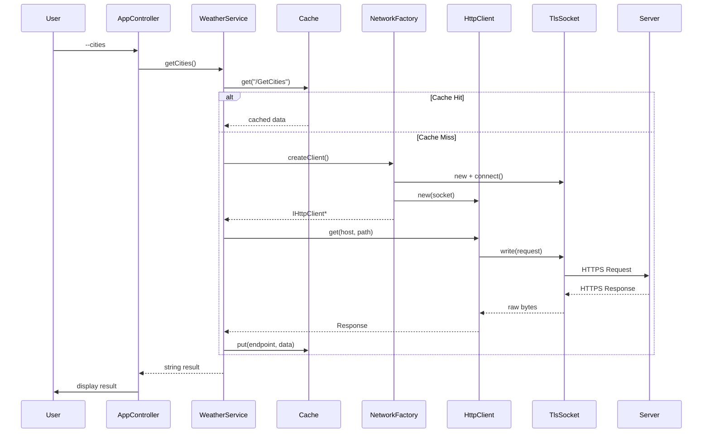

# Architecture

This document provides a deep-dive into the UB-Weather Client architecture.

## Design Philosophy

The codebase is built on three axioms from the **Triad Engineering Doctrine**:

| Axiom | Principle |
|-------|-----------|
| **Teleology** | Implementation serves the stated purpose |
| **Minimalism** | Every abstraction earns its existence |
| **Robustness** | System maintains integrity under stress |

## Layer Architecture

```
┌─────────────────────────────────────────────────────────────┐
│                          UI Layer                           │
│  ┌─────────────┐  ┌─────────────┐  ┌─────────────────────┐  │
│  │ ArgParser   │  │ UserInterface│  │ AppController      │  │
│  │             │  │             │  │                     │  │
│  │ CLI parsing │  │ Console I/O │  │ Flow orchestration  │  │
│  └─────────────┘  └─────────────┘  └─────────────────────┘  │
└─────────────────────────────────────────────────────────────┘
                              │
                              ▼
┌─────────────────────────────────────────────────────────────┐
│                       Service Layer                         │
│  ┌─────────────────────────┐  ┌───────────────────────────┐ │
│  │     WeatherService      │  │     ResponseCache         │ │
│  │                         │  │                           │ │
│  │ - Domain logic          │  │ - TTL-based caching       │ │
│  │ - Endpoint construction │  │ - File-backed storage     │ │
│  │ - Retry orchestration   │  │ - Only caches 200 OK      │ │
│  └─────────────────────────┘  └───────────────────────────┘ │
└─────────────────────────────────────────────────────────────┘
                              │
                              ▼
┌─────────────────────────────────────────────────────────────┐
│                      Network Layer                          │
│  ┌───────────────────┐  ┌─────────────────────────────────┐ │
│  │  NetworkFactory   │  │          HTTP Module            │ │
│  │                   │  │  ┌───────────┐ ┌─────────────┐  │ │
│  │ - DI container    │  │  │HttpClient │ │ HttpBuilder │  │ │
│  │ - Socket creation │  │  │           │ │             │  │ │
│  │ - TLS setup       │  │  │ Protocol  │ │ Request     │  │ │
│  └───────────────────┘  │  │ handling  │ │ construction│  │ │
│                         │  └───────────┘ └─────────────┘  │ │
│  ┌─────────────────────────────────────────────────────┐  │ │
│  │                  Sockets Module                     │  │ │
│  │  ┌─────────────┐  ┌─────────────┐  ┌────────────┐   │  │ │
│  │  │  ISocket    │  │  TcpSocket  │  │ TlsSocket  │   │  │ │
│  │  │ (interface) │  │  (plain)    │  │ (mbedTLS)  │   │  │ │
│  │  └─────────────┘  └─────────────┘  └────────────┘   │  │ │
│  └─────────────────────────────────────────────────────┘  │ │
└─────────────────────────────────────────────────────────────┘
                              │
                              ▼
┌─────────────────────────────────────────────────────────────┐
│                        Core Layer                           │
│  ┌─────────────┐  ┌─────────────┐  ┌─────────────────────┐  │
│  │ConfigManager│  │   Logger    │  │       Utils         │  │
│  │             │  │             │  │                     │  │
│  │ INI parsing │  │ File/stdout │  │ trim, urlEncode,    │  │
│  │ Defaults    │  │ log levels  │  │ toInt, saveFile     │  │
│  └─────────────┘  └─────────────┘  └─────────────────────┘  │
└─────────────────────────────────────────────────────────────┘
```

## Interface-Driven Design

All major components communicate through interfaces, enabling:
- **Unit testing** with mocks
- **Dependency injection**
- **Implementation swapping**

### Core Interfaces

| Interface | Purpose | Implementations |
|-----------|---------|-----------------|
| `ISocket` | Raw socket operations | `TcpSocket`, `TlsSocket` |
| `IHttpClient` | HTTP protocol | `HttpClient` |
| `INetworkFactory` | Socket/client creation | `NetworkFactory` |
| `IResponseCache` | Response caching | `ResponseCache` |
| `IUserInterface` | User I/O | `UserInterface` |

## Data Flow

### Request Flow



## Security Model

### TLS Configuration

```cpp
// TlsSocket.cpp - Strict verification
mbedtls_ssl_conf_authmode(&conf_, MBEDTLS_SSL_VERIFY_REQUIRED);
mbedtls_ssl_conf_ca_chain(&conf_, &cacert_, NULL);
```

| Setting | Value | Rationale |
|---------|-------|-----------|
| Auth Mode | `VERIFY_REQUIRED` | No self-signed certs |
| CA Chain | System store | `/etc/ssl/certs/` |
| Hostname | Verified | Prevents MitM |

## Error Handling Strategy

**No exceptions.** All errors are handled via return values:

```cpp
// Pattern 1: Boolean success
bool connect(const std::string& host, int port);

// Pattern 2: Rich return object
struct Response {
    int status_code;  // 0 = network error
    std::vector<char> body;
    std::map<std::string, std::string> headers;
};
```

### Retry Logic

```cpp
for (int i = 0; i < cfg_.connection_retries; ++i) {
    auto client = networkFactory_.createClient();
    if (!client) {
        Logger::error("Connection failed. Retry " + ...);
        continue;
    }
    result = client->get(host, endpoint);
    if (result.status_code != 0) break;
}
```

## Memory Management

**RAII everywhere.** Resources are managed by owning objects:

| Resource | Owner | Cleanup |
|----------|-------|---------|
| Socket fd | `TcpSocket` | `close()` in dtor |
| TLS context | `TlsSocket` | `mbedtls_*_free()` in dtor |
| HTTP client | `unique_ptr` | Automatic |

## Testing Architecture

```
tests/
├── mocks/
│   ├── MockSocket.hpp       # Simulates network I/O
│   ├── MockHttpClient.hpp   # Controllable responses
│   ├── MockNetworkFactory.hpp
│   ├── MockUserInterface.hpp
│   └── StubCache.hpp        # In-memory cache
├── UtilsTest.cpp
├── ConfigManagerTest.cpp
├── HttpClientTest.cpp
├── WeatherServiceTest.cpp
└── AppControllerTest.cpp
```

Each test suite is self-contained and links against production code + mocks.

## Build System

The Makefile supports:

| Target | Purpose |
|--------|---------|
| `make` | Build main executable |
| `make test` | Build and run all tests |
| `make clean` | Remove build artifacts |
| `make format` | Run clang-format |

Dependencies are tracked automatically via `-MMD -MP`.
